## Descripcion

Aplicacion web tipo Pokedex construida con React, Vite y TypeScript. La app consume la API publica PokeAPI para listar Pokemon, consultar informacion detallada, buscar por nombre o numero, filtrar resultados, guardar favoritos, construir un equipo y comparar estadisticas base entre dos Pokemon.

El proyecto corresponde a la actividad de Aplicaciones Web y Aplicaciones Moviles. Su objetivo es demostrar consumo de API REST, organizacion por componentes, manejo de estado, persistencia local, manejo de errores, responsividad y uso de Git con commits progresivos.

## Tecnologias utilizadas

- React
- Vite
- TypeScript
- React Router
- Fetch API
- localStorage
- CSS responsive
- pnpm

## API utilizada

- PokeAPI: https://pokeapi.co/api/v2
- Documentacion oficial: https://pokeapi.co/docs/v2

## Instalacion

Requisitos:

- Node.js
- pnpm

Instalar dependencias:

```bash
pnpm install
```

## Ejecucion en desarrollo

```bash
pnpm dev
```

Despues de ejecutar el comando, abrir la URL que muestra Vite en la terminal. Normalmente sera:

```txt
http://localhost:5173
```

## Comandos utiles

Ejecutar revision de lint:

```bash
pnpm lint
```

Generar build de produccion:

```bash
pnpm build
```

Previsualizar el build:

```bash
pnpm preview
```

## Funcionalidades implementadas

- Listado de Pokemon con nombre, imagen, numero y tipos.
- Detalle de Pokemon seleccionado con imagen, tipos, altura, peso, categoria, descripcion, habilidades, estadisticas base y cadena evolutiva.
- Busqueda por nombre y numero.
- Filtro por tipo.
- Filtro por generacion.
- Ordenamiento por numero, nombre, altura y peso.
- Favoritos con persistencia en localStorage.
- Constructor de equipo de hasta 6 Pokemon con persistencia en localStorage.
- Comparador de estadisticas base entre dos Pokemon.
- Estados de carga, error y sin resultados.
- Paginacion del listado.
- Modo claro y modo oscuro.
- Barras visuales para estadisticas.
- Diseno responsive para escritorio y pantallas pequenas.
- Colores visuales relacionados con el tipo principal del Pokemon.

## Requerimientos cubiertos

| ID | Requerimiento | Estado |
| --- | --- | --- |
| RF01 | Listado de Pokemon | Completado |
| RF02 | Detalle de Pokemon | Completado |
| RF03 | Busqueda por nombre | Completado |
| RF04 | Filtros por tipo | Completado |
| RF05 | Favoritos con persistencia local | Completado |
| RF06 | Comparador de estadisticas | Completado |
| RF07 | Estados de carga, error y sin resultados | Completado |
| RT01 | Uso de TypeScript | Completado |
| RT02 | Logica de API separada en servicios | Completado |
| RT03 | Componentes reutilizables | Completado |
| RT04 | Tipos e interfaces para respuestas principales | Completado |
| RT05 | Manejo de errores de red | Completado |
| RT06 | Commits claros y progresivos | Completado |
| RT07 | Interfaz responsive | Completado |
| RT08 | Logica separada por archivos y responsabilidades | Completado |

## Estructura del proyecto

```txt
src/
  components/   Componentes reutilizables de la interfaz
  hooks/        Logica reutilizable para datos, filtros, favoritos y equipo
  pages/        Pantallas principales
  services/     Consumo de PokeAPI
  storage/      Lectura y escritura en localStorage
  types/        Tipos e interfaces de TypeScript
  utils/        Funciones auxiliares de formato
```

## Capturas de pantalla

Las evidencias visuales se encuentran en la carpeta `screenshots/`.

| Vista | Captura |
| --- | --- |
| Listado principal en modo claro | 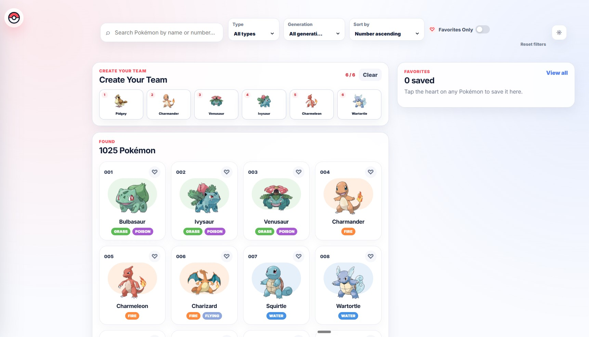 |
| Listado principal en modo oscuro | 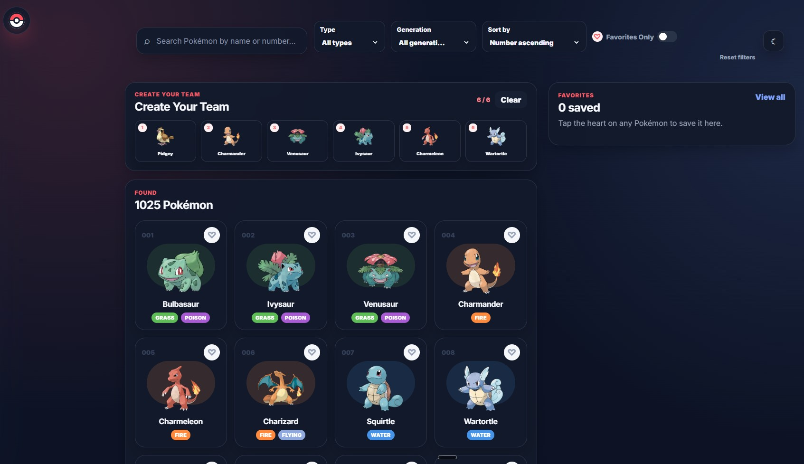 |
| Panel de detalle | 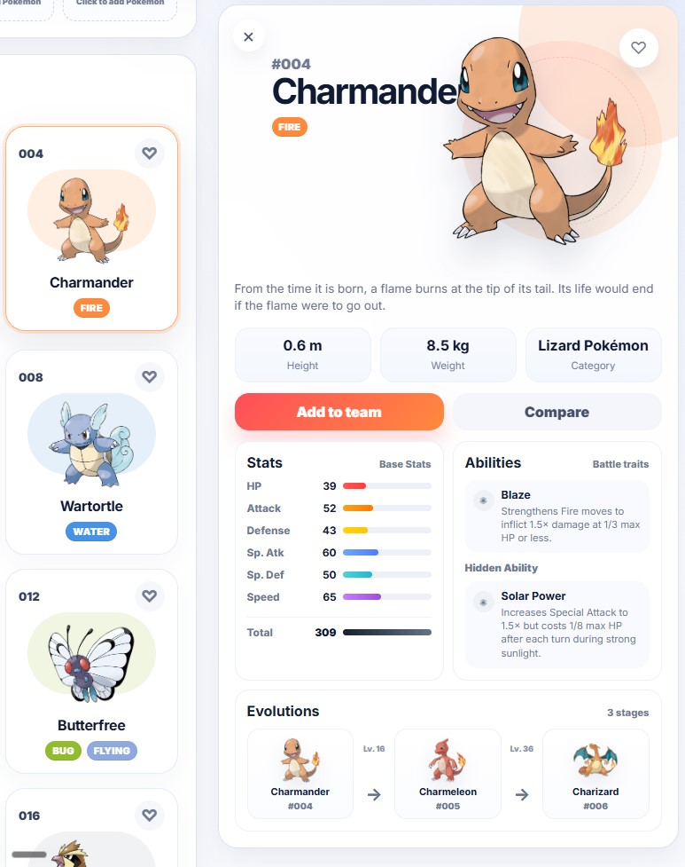 |
| Filtro por tipo | 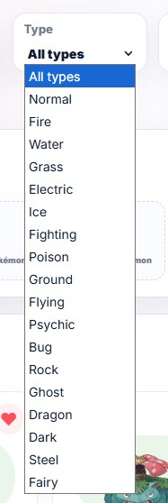 |
| Filtro por generacion | 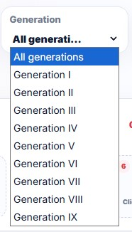 |
| Ordenamiento | 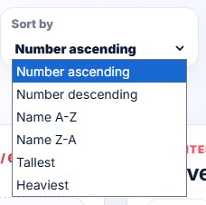 |
| Favoritos | 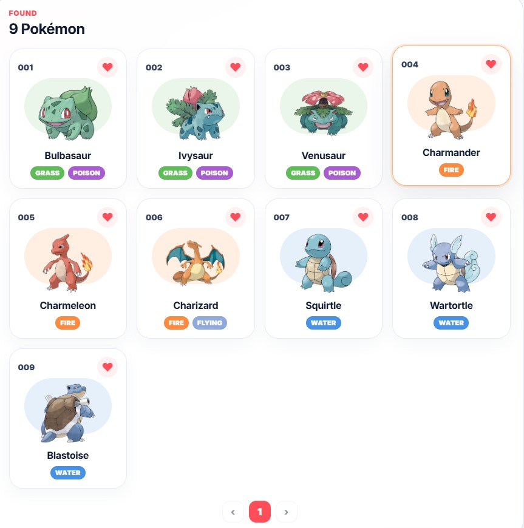 |
| Favoritos persistentes | 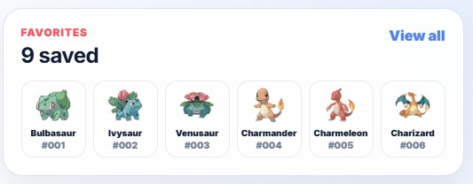 |
| Constructor de equipo | 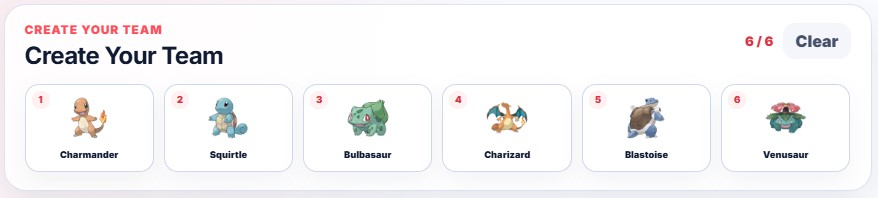 |
| Comparador - seleccion inicial | 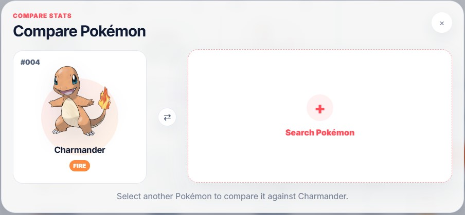 |
| Comparador - busqueda | 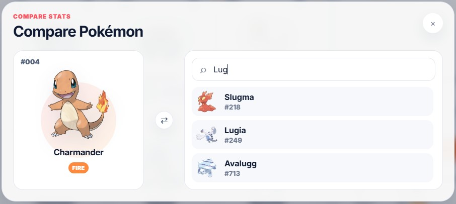 |
| Comparador - Pokemon seleccionado | 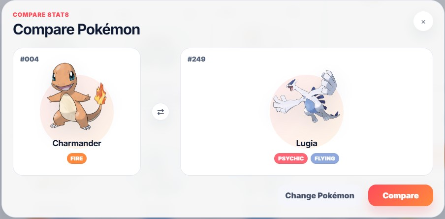 |
| Comparador - resultados | 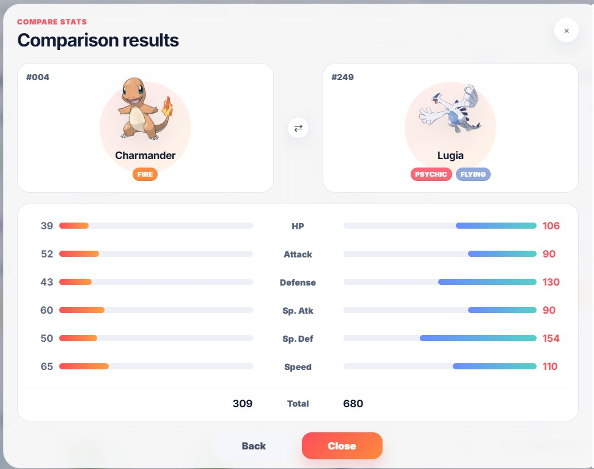 |
| Paginacion | 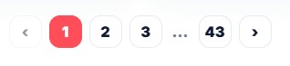 |

## Problemas encontrados y solucion

- El listado inicial de PokeAPI solo entrega `name` y `url`.
  - Solucion: se creo `getPokemonBatch`, que obtiene la lista y despues consulta el detalle de cada Pokemon para mostrar imagen, tipos, altura, peso, habilidades y estadisticas.
- Cargar informacion extra de todos los Pokemon desde el inicio podia volver lenta la aplicacion.
  - Solucion: el detalle extendido, habilidades y cadena evolutiva se consultan solo cuando el usuario selecciona un Pokemon.
- Mostrar o procesar los 1025 Pokemon al mismo tiempo podia afectar el rendimiento de la interfaz.
  - Solucion: la lista base se carga una vez, pero el hook `usePokemonFilters` pagina los resultados y solo entrega 24 Pokemon visibles por pagina. Asi se evita renderizar toda la coleccion de una sola vez.
- Al buscar, filtrar, ordenar o cambiar de pagina, la aplicacion podia recalcular la misma lista derivada en cada render.
  - Solucion: se uso `useMemo` para reutilizar resultados calculados cuando las dependencias no cambian, evitando reprocesar filtros, ordenamientos, favoritos y paginacion innecesariamente.
- Era necesario conservar favoritos y equipo al recargar la pagina.
  - Solucion: se guardan arreglos de IDs en localStorage.
- El filtro, ordenamiento y paginacion podian mezclar responsabilidades con la vista.
  - Solucion: se separo esa logica en el hook `usePokemonFilters`.
- Algunas peticiones secundarias pueden fallar.
  - Solucion: la app mantiene el detalle basico disponible y muestra estados de carga, error o informacion parcial.

## Correcciones recientes

- Fecha: 24-05-2026 — Correcciones aplicadas para resolver errores de compilación TypeScript y mejorar compatibilidad.
  - Se eliminó la referencia explícita a `vite/client` en `tsconfig.app.json` para evitar errores de definición de tipos.
  - Se ajustaron las formas de los objetos `sprites` en `src/services/pokemonService.ts` para que coincidan con las interfaces de TypeScript.
  - Se recortaron las propiedades devueltas por `getPokemonDetails` y `getPokemonBatch` para cumplir con la interfaz `Pokemon`.
  - Se instaló el conjunto de dependencias del proyecto (`npm install` / `pnpm install`) para permitir comprobaciones y ejecución en desarrollo.

### Cómo comprobar tipos y ejecutar en desarrollo

Instalar dependencias (elige uno):

```bash
pnpm install
# o
npm install
```

Comprobación de tipos (TypeScript):

```bash
npx tsc -b
```

Ejecutar servidor de desarrollo:

```bash
pnpm dev
# o
npm run dev
```

## Flujo sugerido para la demo

1. Abrir la aplicacion y mostrar el listado principal.
2. Usar la busqueda por nombre o numero.
3. Aplicar filtro por tipo o generacion.
4. Seleccionar un Pokemon y mostrar el panel de detalle.
5. Agregar Pokemon a favoritos y al equipo.
6. Abrir el comparador y comparar dos Pokemon.
7. Cambiar entre modo claro y oscuro.
8. Mostrar la responsividad reduciendo el ancho de pantalla.

## Historial resumido de commits

| Hash | Mensaje |
| --- | --- |
| `b1ded85` | feat(data): ampliar consumo de PokeAPI |
| `8ad9f8e` | refactor(ui): separar tarjetas y listado |
| `65f5bde` | feat(filters): agregar busqueda filtros y paginacion |
| `62ed1fe` | feat(collections): agregar favoritos y equipo |
| `3edcaea` | feat(details): enriquecer panel de detalle |
| `8f41889` | feat(compare): agregar comparador de estadisticas |
| `4ca39a6` | feat(app): integrar experiencia completa |
| `96cb83f` | docs: actualizar avance y uso del proyecto |

## Fuentes de referencia

- PokeAPI Docs: https://pokeapi.co/docs/v2
- PokeAPI: https://pokeapi.co/
- React: https://react.dev/
- Vite: https://vite.dev/
